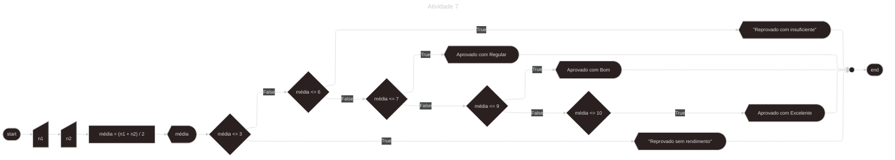
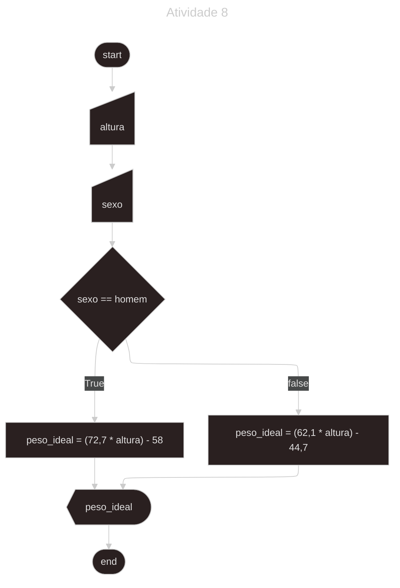
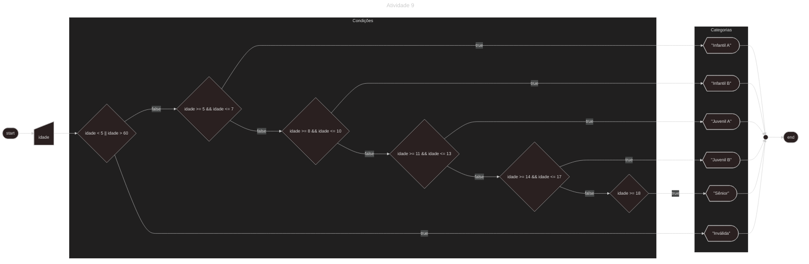
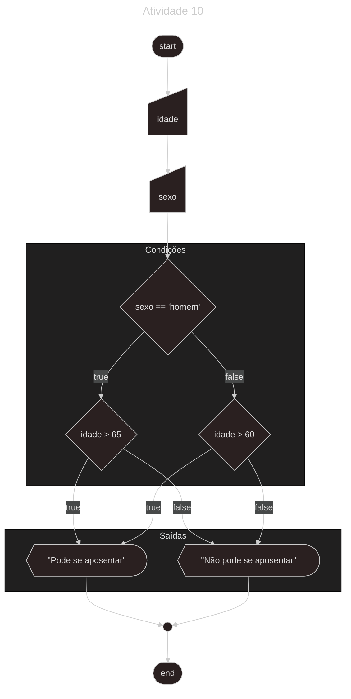
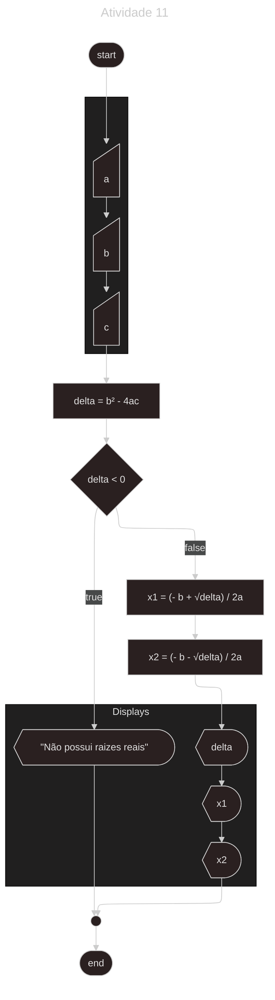
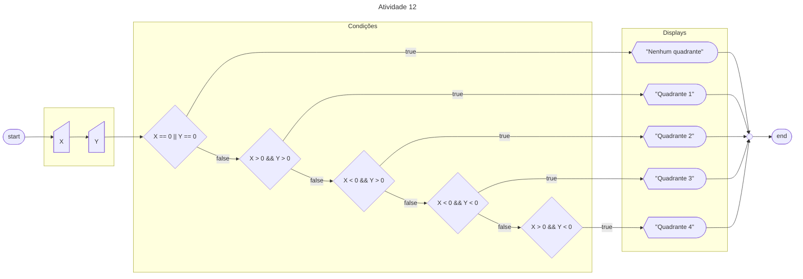
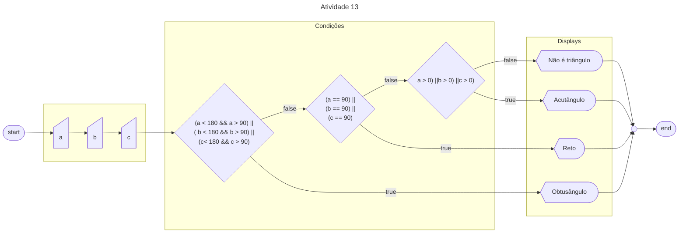
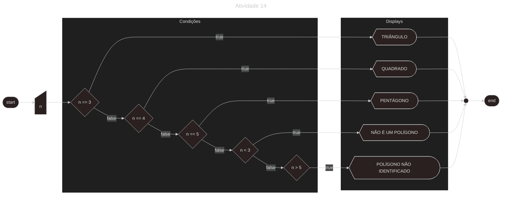
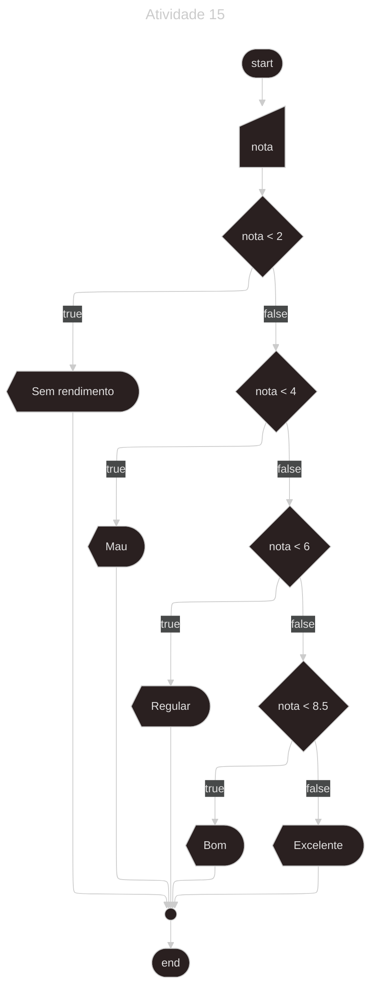

# Parte 2 - Estrutura condicional simples e composta

1. Escrever um algoritmo que leia dois valores numéricos e escreva o menor valor.

- [Diagrama: ](/Parte-2/atividade1.png)<br>

- [Código atividade 1: ](/Parte-2/atividade1.py)
    ```python

    ```

2. Escrever um algoritmo que leia valores referentes às duas notas escolares de um aluno. Calcular a média e escrever: a média e a situação do aluno. Considerando: "Aprovado por Média” se (media >=7), "Não Aprovado por média” se (média < 7).

- [Diagrama: ](/Parte-2/atividade2.png)<br>

- [Código atividade 2: ](/Parte-2/atividade2.py)
    ```python

    ```

3. Escrever um algoritmo que leia dois valores numéricos, efetue a adição desses valores. Se o valor somado for maior ou igual a dez, este deve ser escrito somando-se a ele mais cinco; caso contrário este deverá ser escrito subtraindo-se sete.

- [Diagrama: ](/Parte-2/atividade3.png)<br>

- [Código atividade 3: ](/Parte-2/atividade3.py)
    ```python

    ```

4. Criar um algoritmo que leia dois números e imprimir uma mensagem dizendo se eles são iguais ou diferentes. Se forem diferentes, imprimir em ordem crescente.

- [Diagrama: ](/Parte-2/atividade4.png)<br>

- [Código atividade 4: ](/Parte-2/atividade4.py)
    ```python

    ```

5. Elabore um algoritmo que leia dois valores digitados pelo usuário em seguida leia uma operação matemática desejada [ + , - , * , / ], após ler os valores e a operação calcular e escrever o resultado desta da operação.

- [Diagrama: ](/Parte-2/atividade5.png)<br>

- [Código atividade 5: ](/Parte-2/atividade5.py)
    ```python

    ```

6. Elaborar um algoritmo que efetue o cálculo do reajuste de salário de um funcionário. Considere que o funcionário deve receber um reajuste de 15% caso seu salário seja menor que R$ 800,00. Se o salário for maior ou igual a R$ 800,00 e menor ou igual a R$ 1.500,00, seu reajuste será de 10%, e caso seja maior que R$ 1.500,00, o reajuste deverá ser de 5%.

- [Diagrama: ](/Parte-2/atividade6.png)<br>

- [Código atividade 6: ](/Parte-2/atividade6.py)
    ```python

    ```

7. Escrever um algoritmo que leia duas notas escolares de um aluno, calcule sua média e escreva a média calculada e sua situação final. Considerando: se (media <= 3): “Reprovado sem rendimento", se (3 < média <= 6): "Reprovado com Insuficiente", se (6 < média <= 7): "Aprovado com Regular", se (7 < média <= 9): "Aprovado com Bom" e finalmente se (9 < média <= 10): "Aprovado com Excelente".


- [Diagrama: ](/Parte-2/atividade7.png)<br>


- [Código atividade 7: ](/Parte-2/atividade7.py)
    ```python

    ```

8. Tendo como dados de entrada a altura e o sexo de uma pessoa, construa um algoritmo que calcule e escreva o seu peso ideal, utilizando as seguintes fórmulas: Para homens: (72,7*h)-58; Para mulheres: (62,1*h)-44,7.

- [Diagrama: ](/Parte-2/atividade8.png)<br>


- [Código atividade 8: ](/Parte-2/atividade8.py)
    ```python

    ```

9. Elabore um algoritmo que, dada a idade de um nadador, classifique-o em uma das seguintes categorias: 
Infantil A: 5 - 7 anos; 
Infantil B: 8 - 10 anos; 
Juvenil A: 11 - 13 anos; 
Juvenil B: 14 - 17 anos; 
Sênior: maiores de 18 anos; 
Inválida: menor que 5 maior 60.

- [Diagrama: ](/Parte-2/atividade9.png)<bra>


- [Código atividade 9: ](/Parte-2/atividade9.py)
    ```python

    ```

10. Elaborar um algoritmo para verificar se um funcionário pode se aposentar, considerando as seguintes condições necessárias: - Condição 1: Se for mulher e estiver com mais de 60 anos; - Condição 2: Se for homem e estiver com mais de 65 anos.

- [Diagrama: ](/Parte-2/atividade10.png)<br>


- [Código atividade 10: ](/Parte-2/atividade10.py)
    ```python

    ```

11. Preparar um algoritmo para ler os valores dos coeficientes a, b e c e imprimir os valores de delta e das raízes reais, quando houver.

- [Diagrama: ](/Parte-2/atividade11.png)<br>


- [Código atividade 11: ](/Parte-2/atividade11.py)
    ```python

    ```

12. Escreva um algoritmo para ler as coordenadas (X,Y) de um ponto no sistema cartesiano e escrever o quadrante ao qual o ponto pertence. Se o ponto estiver sobre os eixos, ou na origem, escrever NÃO ESTÁ EM NENHUM QUADRANTE.

- [Diagrama: ](/Parte-2/atividade12.png)<br>


- [Código atividade 12: ](/Parte-2/atividade12.py)
    ```python

    ```

13. Escreva um algoritmo que leia o valor de 3 ângulos de um triângulo e escreva se o triângulo é acutângulo (possui 3 ângulos agudos), retângulo (possui um ângulo reto) ou obtusângulo (possui um ângulo obtuso).

- [Diagrama: ](/Parte-2/atividade13.png)<br>


- [Código atividade 13: ](/Parte-2/atividade13.py)
    ```python

    ```

14. Escreva um algoritmo para ler o número de lados de um polígono regular. Calcular e imprimir o seguinte:
    a. Se o número de lados for igual a 3 escrever TRIÂNGULO.
    b. Se o número de lados for igual a 4 escrever QUADRADO.
    c. Se o número de lados for igual a 5 escrever PENTÁGONO.
    d. Caso o número de lados seja inferior a 3 escrever NÃO É UM POLÍGONO.
    e. Caso o número de lados seja superior a 5 escrever POLÍGONO NÃO IDENTIFICADO.

- [Diagrama: ](/Parte-2/atividade14.png)<br>


- [Código atividade 14: ](/Parte-2/atividade14.py)
    ```python

    ```

15. Construir um algoritmo que leia uma nota na forma quantitativa e escreva sua correspondente qualitativa, de acordo com a tabela abaixo:
    - Nota Quantitativa / Nota Qualitativa
        - [0; 2] Sem rendimento
        - [2; 4] Mau
        - [4; 6] Regular
        - [6; 8.5] Bom
        - [8.5; 10] Excelente

- [Diagrama: ](/Parte-2/atividade15.png)<br>


- [Código atividade 15: ](/Parte-2/atividade15.py)
    ```python

    ```
