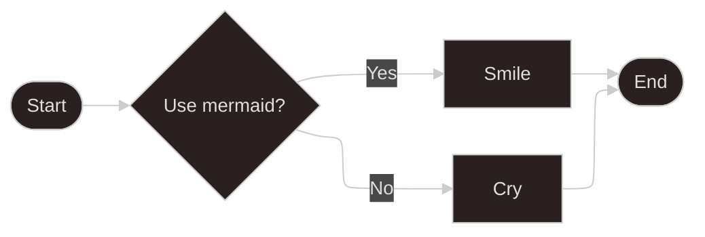

# Atividade 1 de Algoritmos

- Professor: Anderson
- Atividade dividida em 3 partes.

  - [Parte 1](/Parte-1/README.md)
  - [Parte 2](/Parte-2/README.md)
  - [Parte 3](/Parte-3/README.md)

> Kauã Felipe Martins  
> https://github.com/kf-martins-uel/algoritimos-atividade1  

>>mermaid version: v11.4.1
