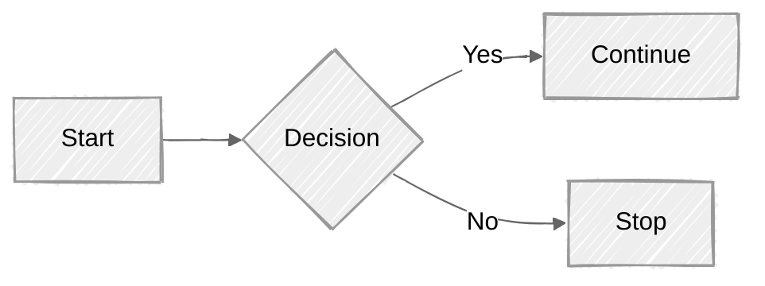

# Atividade 1 de Algoritimo

- Professor: Anderson

- Atividade dividida em 3 partes.

    - [Parte 1](/Parte-1/README.md)
    - [Parte 3](/Parte-2/README.md)
    - [Parte 3](/Parte-3/README.md)

>> Kauã Felipe Martins